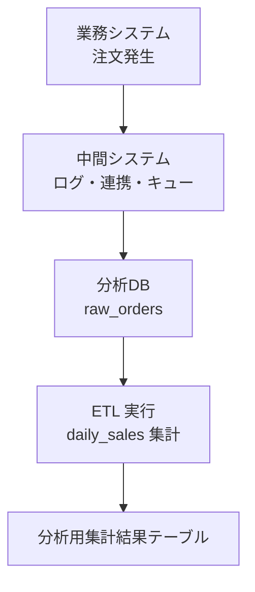

# Daily Sales ETL (PostgreSQL + Python)

## 概要
業務システムから連携された売上データを元に、分析用の日付売上集計テーブルを生成するETLツール。  
遅延到着・修正データが発生する前提で、日付単位で再実行可能な設計としている。

## 特徴
- 日次バッチの再実行を前提とした冪等ETL設計
- 遅延到着・修正データを再処理で吸収可能
- PythonでETL制御、SQLでデータ処理を分離
- トランザクション管理をアプリ側に集約
- CLI引数によるバッチ実行（日次・期間指定）

## 技術スタック
- PostgreSQL:分析DB
- Python (psycopg2):ETL制御・トランザクション管理
- SQL (Window / CTE / Transaction)

## ETLフロ-

※ raw_orders.created_at は「業務上の発生日」であり、分析DBに取り込まれた時刻とは一致しない。

## テーブル構成
- raw_orders：生データ
- daily_sales：日次集計結果

## ETL設計ポイント
- ETL制御：Python  
  - 日付ループ、トランザクション管理、例外処理
- データ処理：SQL  
  - 集計・再計算ロジックをSQLに集約
- 日付単位で再実行可能な設計  
  - DELETE + INSERT による冪等性確保
- プレースホルダを用いた安全なSQL実行

## ディレクトリ構成
```text
daily-sales-etl/
├── etl/
│   ├── main.py        # CLI・日付ループ制御
│   ├── daily_sales.py # 日次売上ETL処理
│   ├── db.py          # DB接続管理
│   └── sql.py         # SQL読み込み
├── sql/
│   └── daily_sales_etl.sql
├── requirements.txt
└── README.md
```

## サンプルデータ生成
- PostgreSQL の generate_series を用いて100~1000件のランダムデータを生成可能。
- ローカル環境でもETL動作を再現できる。

## 実行手順
1. `.env`を作成しDB接続情報を設定
2. 依存ライブラリをインストール
```bash
pip install -r requirements.txt
```
## 実行例
```bash
python -m etl.main --date 2025-12-01
python -m etl.main --start-date 2025-12-01 --end-date 2025-12-03
```
