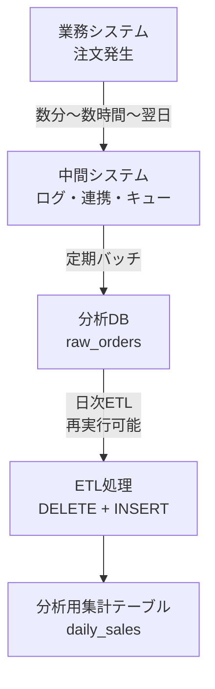

# Daily Sales ETL (PostgreSQL + Python)

## 概要
本プロジェクトは、データ基盤運用業務における  
**ETL開発・運用の実務イメージを再現**することを目的としています。

分析DBへのデータ取り込み遅延や、後続のデータ修正が発生しても、  
**日付単位で安全に再実行できるETL設計**を採用しています。

## 本プロジェクトの目的
- データ基盤運用業務（ETL開発・運用）の実務構成を理解する
- 遅延到着・修正データを前提としたETL設計を実装する
- SQL単体ではなく、ETL全体を制御するアプリケーション設計を学ぶ

## 想定ユースケース
- 日次バッチによる売上集計
- 遅延データ・修正データの再計算
- 分析用データマートの生成・保守
- データ基盤運用の検証・学習用途

## 特徴
- 日次バッチ再実行を前提とした**冪等ETL設計**
- 遅延到着・修正データを再処理で吸収可能
- ETL制御（Python）とデータ処理（SQL）の責務分離
- トランザクション管理をアプリケーション側に集約
- CLI引数によるバッチ実行（日次・期間指定）
- エラー発生時の自動ロールバックとログ出力

## 技術スタック
- PostgreSQL (分析DB)
- Python (psycopg2)
- SQL (Window / CTE / Transaction)
- logging（標準出力 + ファイル出力）

## ETLフロー概要

※ raw_orders.created_at は業務上の発生日を示す。

※ 分析DBへの取り込みは遅延する可能性があるため、ETLは日付単位で再実行可能な設計とし、遅延・修正データを再計算で吸収する。

## テーブル構成
- raw_orders：生データ
- daily_sales：日次集計結果

## ETL設計ポイント

### 冪等性（再実行可能）
- 日付単位で DELETE + INSERT
- 同じ日を何度実行しても正しい結果になる
- 遅延到着・修正データを安全に再集計するため

### トランザクション管理
- SQLにBEGIN/COMMITは書かず、Python側で制御
- ETL全体の成功・失敗を1トランザクションとして扱う
- SQL単体成功でも、ETLとして失敗するケースを防ぐため

### セキュリティ
- SQLはすべてプレースホルダで実行
- SQLインジェクション対策を考慮

### ログ設計
- ETL開始 / 成功 / 失敗をログ出力
- 処理日付・ジョブIDをログに含める
- 障害発生時に処理状況を追跡可能

## ディレクトリ構成
```text
daily-sales-etl/
├── etl/
│   ├── main.py        # CLI・ETL起動点
│   ├── daily_sales.py # 日次売上ETL処理
│   ├── db.py          # DB接続管理
│   ├── sql.py         # 日付ループ制御
│   └── logger.py      # ログ設定
├── sql/
│   └── daily_sales_etl.sql
├── requirements.txt
└── README.md
```

## サンプルデータ生成
- generate_series を用いたサンプルデータ生成SQLを用意
- 件数（100〜1000件）はSQL内で調整可能

## 実行手順
1. `.env`を作成しDB接続情報を設定
2. 依存ライブラリをインストール
```bash
pip install -r requirements.txt
```
## 実行例
```bash
python -m etl.main --date 2025-12-01
python -m etl.main --start-date 2025-12-01 --end-date 2025-12-03
```

## 設計で苦労した点

### ① トランザクション管理の責務分離
当初は SQL 側に BEGIN / COMMIT を記述していたが、
ETL は「SQL単体」では完結せず、複数処理をまとめて制御する必要があると気づいた。

SQL側でコミットしてしまうと、
- SQLは成功したがETL全体としては失敗
- 一部だけ反映された不整合な状態

が発生しうるため、
トランザクション管理は Python 側に一本化し、
ETL全体の成功・失敗を1トランザクションとして扱う設計に変更した。

### ② 遅延到着・修正データへの対応設計
created_at（業務上の発生日）を基準に単純集計すると、
分析DBへの到着遅延や後からのデータ修正を拾えない問題がある。

そのため、
- 日付単位で既存集計を削除
- 再集計して再投入（DELETE + INSERT）

という再実行可能な設計にし、同じ日付を何度実行しても常に正しい結果になるようにした。

### ③ 安全なSQL実行（SQLインジェクション対策）
ETLは日付などの外部入力を扱うため、SQL文字列への直接埋め込みは危険と判断。

すべてのSQL実行でプレースホルダを使用し、SQLインジェクションを防止する実装とした。


